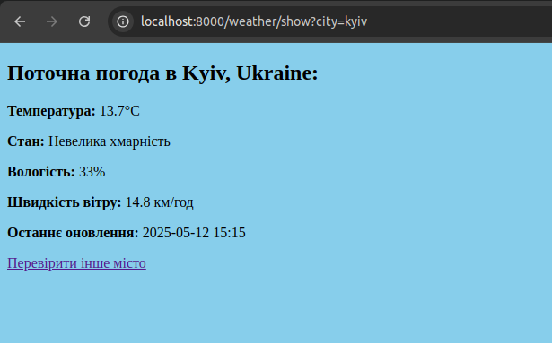

# Symfony Weather API Application

A Symfony-based weather application that displays current weather information.

## Screenshots

### Weather Search Form

*Головна сторінка з формою пошуку міста*

### Weather Display

*Відображення погоди для міста Київ*

## Основні функції

- 🌡️ Відображення погоди в реальному часі
- 🇺🇦 Інтерфейс українською мовою
- 🔑 Безпечне управління API ключем
- 📝 Обробка та логування помилок
- 🧪 Модульне тестування

## Технічні вимоги

- PHP 8.1 або вище
- Symfony 6.4 LTS
- Composer
- API ключ від WeatherAPI.com

## Встановлення

1. Клонуйте репозиторій:
```bash
git clone https://github.com/icedev07/symfony-weather-api.git
cd symfony-weather-api
```

2. Встановіть залежності:
```bash
composer install
```

3. Налаштуйте змінні середовища:
```bash
cp .env .env.local
```
Відредагуйте `.env.local` та додайте ваш WeatherAPI ключ: 